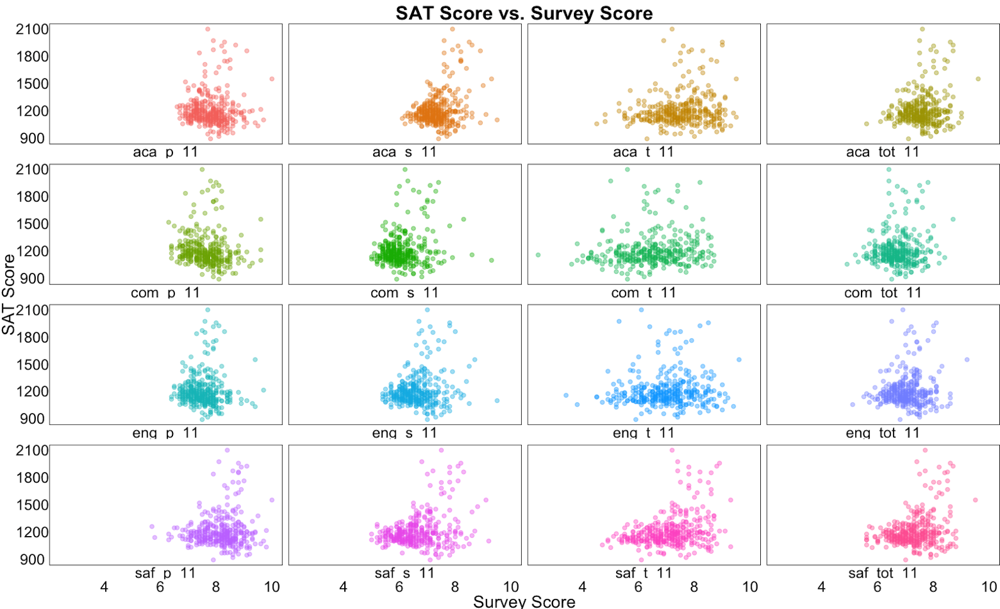
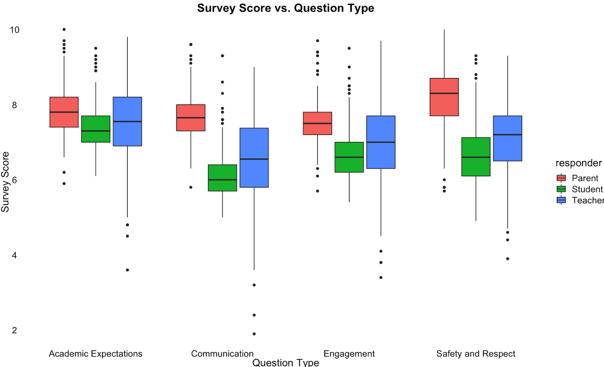

# Projects of Data Analysis

This repository is a series of notebooks of data analysis related projects using Python or R.

Some features like internal links, SVG are not rendered correctly in GitHub, so it's recommended to view it in nbviewer, a tool created by Jupyter community for rendering a notebook hosted on GitHub.

Here is the list of projects and the corresponding nbviewer links:

## Python

- [Visualizing U.S. Plug-in Electric Vehicle Sales](https://github.com/eeliuqin/data-analysis/blob/main/us-plug-in-electric-vehicle-sales.ipynb) (clich [hear](https://nbviewer.org/github/eeliuqin/data-analysis/blob/main/us-plug-in-electric-vehicle-sales.ipynb) to view it in nbviewer)
  * Task: EDA of the U.S. PEV sales data, finding out the top models, top makers, and Tesla vs. Non Tesla sales.
  * Data source: The data file [us-plug-in-ev-sales.csv](https://github.com/eeliuqin/data-analysis/blob/main/data/us-plug-in-ev-sales.csv) contains U.S. Plug-in Electric Vehicle Sales, 2010-2019. It was scraped from 4 websites about auto.
  * Visualization:
  

    
Click<a href="https://public.tableau.com/app/profile/qinliu/viz/2010-2019U_S_Plug-inElectricVehiclesPEVSales/PEVSalesStory" target="_blank"> here </a>to view it in Tableau

    

    </a>
  

  
- [Analyzing Strategy Games on Apple App Store](https://github.com/eeliuqin/data-analysis/blob/main/mobile-strategy-games.ipynb) (click [here](https://nbviewer.org/github/eeliuqin/data-analysis/blob/main/mobile-strategy-games.ipynb) to view it in nbviewer)
  * Task: Analyzing mobile strategy games by classifications, price, user ratings, and competitors. Providing recommendations to mobile game developers.
  * Data source: 17K Mobile Strategy Games dataset found in [Kaggle](https://www.kaggle.com/datasets/tristan581/17k-apple-app-store-strategy-games?select=appstore_games.csv).
  * Visualization:
  

    
    &nbsp; &nbsp;
    
  

- [Finding the Most Popular Data Science Questions](https://github.com/eeliuqin/data-analysis/blob/main/popular-data-science-questions.ipynb) (click [here](https://nbviewer.org/github/eeliuqin/data-analysis/blob/main/popular-data-science-questions.ipynb) to view it in nbviewer)
  * Task: Finding out the most popular data science questions and provide recommendations for online education sites that focus on data science.
  * Data source: Run SQL query and download the corresponding .csv file from [Data Science Stack Exchange](https://data.stackexchange.com/datascience/query/new).
  * Visualization:
  

    
    &nbsp; &nbsp;
    
  

- [Exploring CIA World Factbook](https://github.com/eeliuqin/data-analysis/blob/main/cia-world-factbook-visualization.ipynb) (click [here](https://nbviewer.org/github/eeliuqin/data-analysis/blob/main/cia-world-factbook-visualization.ipynb) to view it in nbviewer)
  * Task: EDA of the world's facts, including population, population density, population growth rate, mortality rate, and migration rate.
  * Data source: Single-File SQLite Distribution of 260+ World Factbook Country Profiles that can be downloaded from [Github](https://github.com/factbook/factbook.sql/releases).
  * Visualization:
  

    
    &nbsp; &nbsp;
    
  
  

## R

- [Capstone Project of the Google Data Analytics Professional Certificate: Cyclistic Bike-Share Analysis](https://github.com/eeliuqin/data-analysis/blob/main/google-da-capstone-project-bike-share.ipynb) (click [here](https://nbviewer.org/github/eeliuqin/data-analysis/blob/main/google-da-capstone-project-bike-share.ipynb) to view it in nbviewer)
  * Task: Analyzing how the Cyclistic bikes are used differently by casual riders and annual members. Devising a new marketing strategy to turn casual riders into annual members.
  * Data source: Chicago Divvy Bicycle Sharing Data from May, 2021 to April, 2022. The data can be downloaded [here](https://divvy-tripdata.s3.amazonaws.com/index.html).
  * Visualization:
  

    
    &nbsp; &nbsp;
    
  
 

- [Understanding Worldwide COVID-19 Vaccination Progress](https://github.com/eeliuqin/data-analysis/blob/main/covid19-vaccination-progress.ipynb) (click [here](https://nbviewer.org/github/eeliuqin/data-analysis/blob/main/covid19-vaccination-progress.ipynb) to view it in nbviewer)
  * Task: Analyzing vaccination rates by country and vaccines used by countries. 
  * Data source: `country_vaccinations.csv` from [Kaggle](https://www.kaggle.com/datasets/gpreda/covid-world-vaccination-progress?datasetId=1093816&language=R&select=country_vaccinations.csv). Data was collected daily from the GitHub repository [covid 19 data](https://github.com/owid/covid-19-data). 
  * Visualization:
  

    
    &nbsp; &nbsp;
    
  
 

- [Exploring NYC High Schools Perceptions](https://github.com/eeliuqin/data-analysis/blob/main/nyc-high-schools-perceptions.ipynb) (click [here](https://nbviewer.org/github/eeliuqin/data-analysis/blob/main/nyc-high-schools-perceptions.ipynb) to view it in nbviewer)
  * Task: Analyzing whether perceptions of NYC school quality are related to demographic and academic success metrics.
  * Data source: The NYC school data was compiled from publicly available data provided by the city of New York. It has been cleaned up and uploaded by Dataquest, and can be downloaded from [here](https://data.world/login?next=%2Fdataquest%2Fnyc-schools-data%2Fworkspace%2Ffile%3Ffilename%3Dcombined.csv).
  * Visualization:
  

    
    &nbsp; &nbsp;
    
  
 

- [Analyzing Forest Fires Data](https://github.com/eeliuqin/data-analysis/blob/main/forest-fires.ipynb) (click [here](https://nbviewer.org/github/eeliuqin/data-analysis/blob/main/forest-fires.ipynb) to view it in nbviewer)
  * Task: Investigating when forest fires were most frequent and if any patterns existed.
  * Data source: [forestfires.csv](https://archive.ics.uci.edu/ml/machine-learning-databases/forest-fires/) is a dataset of forest fires in Montesinho park, Portugal, collected from January 2000 to December 2003.
  * Visualization:
  

    
    &nbsp; &nbsp;
    
  

